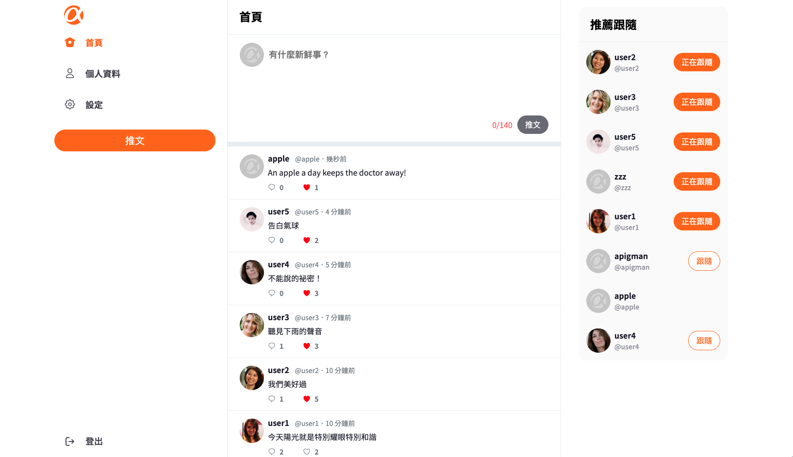

# simple-twitter-frontend



## 簡介

- 本專案是以 twitter 規格為發想的 simple twitter 專案。
- 前端使用 Vue 2、Vue Router、Vuex、SCSS、Bootstrap 5 開發使用者介面，後端使用 Node.js 搭配 Express 框架建構，使用關聯式資料庫 MySQL 做為 database。
- 本專案為前端開發之專案。

## 專案網站入口

[Simple Twitter](https://csw8524.github.io/simple-twitter-frontend/#/)

### 測試帳號

account: user1  
password: 12345678

## 產品功能

1. 使用者可以註冊帳號，並登入網站，編輯個人資料，包括名稱、帳號、密碼、email、介紹、個人顯示圖片與背景圖片。
2. 使用者可以發布自己的文字推文訊息。
3. 使用者可以對他人推文留言和按下喜歡。
4. 使用者可以追蹤其他使用者或取消追蹤。
5. 使用者可以瀏覽其他使用者個人介紹頁面，瀏覽對方的歷史推文、留言、喜歡的內容、追蹤中的使用者及追蹤該名使用者的清單。

## 後端專案

[後端專案 Repo 連結](https://github.com/csw8524/SimpleTwitter)

## 啟動專案

### 下載此專案後進入專案資料夾輸入指令安裝需要的套件

```=bash
npm install
```

### 在本地端啟動專案

```=bash
npm run serve
```

### 打包專案

```=bash
npm run build
```

## 開發工具

- vue: 2.6.11
- vue-router: 3.2.0
- vuex: 3.4.0
- axios: 1.2.1
- bootstrap: 5.2.3
- dayjs: 1.11.7
- sweetalert2: 11.6.15
